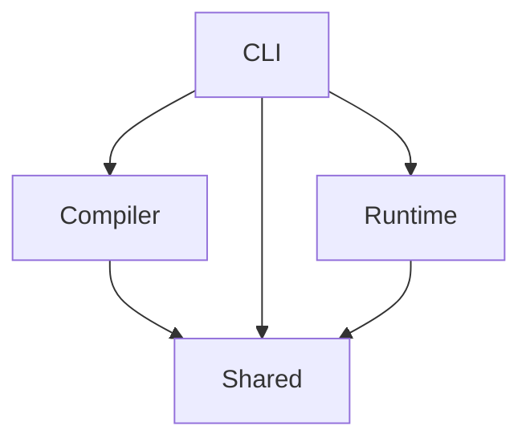

# Ruslox
Ruslox is the Rust implementation of Lox language, with some difference from the `clox` compiler and VM.

- [Ruslox](#ruslox)
  - [Project Structure](#project-structure)
  - [Error Codes](#error-codes)
    - [Compile Error Codes](#compile-error-codes)
    - [Runtime Error Codes](#runtime-error-codes)

## Project Structure
After deleting and re-creating the project multiple times, I've found the necessity and convenience of (virtual) workspaces using Cargo. With proper separation of code, we can avoid *refactor hell* in many cases.

> I mean the situation when different modules are coupled too tight, and one little change will cause a cluster of refatoring. Build-system level separation is a good constraint.

This project (vitual workspace) is divided into four main crates:
1. **`shared`**: Shared codebase. For example, the `Chunk` data structure is both needed at compile time (codegen) and runtime (executing bytecode instructions).
2. **`compiler`**: Scan, parse and compile the source code to bytecode.
3. **`runtime`**: VM and related object models.
4. **`cli`**: Simply calling compiler and then pass compiled chunk to VM.

Their dependency relation is like the graph below:

## Error Codes
The error code concept is introduced with `codespan-reporting` as the supporting crate. Instead of simply `printf` the error message and line number into the `stdout` / `stderr` stream in `clox`, Ruslox generates diagnostics with messages, notes, and labels pointing the position of compile errors in source. Error codes can help locating the potential internal problems in the meantime.

### Compile Error Codes
- `E0001`: too many constants in one chunk
- `E0002`: unexpected character
- `E0003`: uninterpretable number literal
- `E0004`: unterminated string

### Runtime Error Codes
- `E1001`: stack overflow
- `E1002`: stack underflow
- `E1003`: operands must be numbers
- `E1004`: operand must be number
- `E1005`: concatenation operands must be both numbers or both strings.