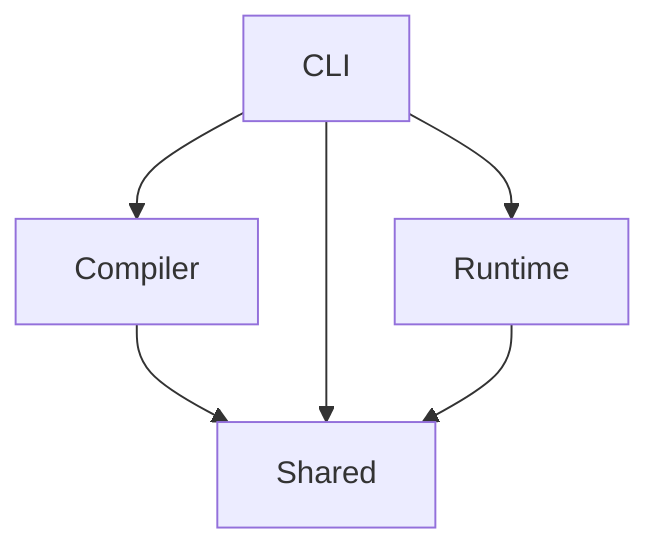

# Ruslox
Ruslox is the Rust implementation of Lox language, with some difference from the `clox` compiler and VM.

- [Ruslox](#ruslox)
  - [Project Structure](#project-structure)
  - [Difference from `clox`](#difference-from-clox)
    - [Module Separation](#module-separation)
    - [Parser](#parser)
  - [Personal Thinking](#personal-thinking)
    - [PEG and Error Recovery](#peg-and-error-recovery)
  - [Error Codes](#error-codes)

## Project Structure
After deleting and re-creating the project multiple times, I've found the necessity and convenience of (virtual) workspaces using Cargo. With proper separation of code, we can avoid *refactor hell* in many cases.

> I mean the situation when different modules are coupled too tight, and one little change will cause a cluster of refatoring. Build-system level separation is a good constraint.

This project (vitual workspace) is divided into four main crates:
1. **`shared`**: Shared codebase. For example, the `Chunk` data structure is both needed at compile time (codegen) and runtime (executing bytecode instructions).
2. **`compiler`**: Scan, parse and compile the source code to bytecode.
3. **`runtime`**: VM and related object models.
4. **`cli`**: Simply calling compiler and then pass compiled chunk to VM.

Their dependency relation is described in the graph below:



## Difference from `clox`
Ruslox is written in Rust style along with some thirdparty crates. There's some difference from the single-pass `clox` compiler.
### Module Separation
`clox` is not full-separated into decoupled modules, although it has separated different functionalities into source files.
   > For example: Ruslox has two different structs: `Constant` and `Value`. The former represents compile-time constants in one chunk: strings and numbers. The latter represents valid data types at run-time: numbers, strings, *objects* and so on.
   >
   > The point is: `compile` module does not rely on `runtime` module, and chunks can not store objects at compile time. Although `Constant` has some overlapping variants with `Value`, they have different semantics.

### Parser
Instead of the hand-written, Ruslox uses `peg` crate to generate recursive-decent parser, which transform Lox source to AST first, and then translate AST to bytecode. This makes Ruslox get rid of single-pass restrictions, while introducing some difficulty in co-operate with parser generator.

Those differences in implementation lead to different behaviors.
1. **Shadowing**: In `clox`, two special *variable shadowing* patterns below are forbidden.
   ```javascript
   var a = 1;
   {
       var a = a; // Shadowing outer variables with its value.
   }
   ```
   > This is because of clox's single-pass compilation. It sees the inner `var a = a;` as declaring `a` with the uninitialized `a` value.
   ```javascript
   {
       var a = 1;
       var a = a; // Shadowing in the same scope.
   }
   ```
   > This is personal preference since it's Ruslox. Rust says yes to same-scope shadowing.


## Personal Thinking
When writing Ruslox, I encountered several difficulties and problems, which make me think a step further.

### PEG and Error Recovery
When using PEG, recursive descent parser (with precedence) can be generated by defining grammar(s). The main mechanism is very clear: if a rule is matched, the action attached to it will be performed; otherwise, the generated parser will bactrack in order to match other rules.

That is, in most cases, more convenient than the hand-written one with no backtracking. But the problem appears when it comes to **blocks**.

Let's assume there exist some PEG grammar:
```
declaration     = var_declaration
                / statement
                / ![';'] [_]+ { report_error(...) }
var_declaration = "var" [Token::Identifier] "=" expression() ";"
statement       = block
block           = "{" declaration* "}"
```
This little "language" will allow only variable declarations and block statement containing multiple declarations. It seems great, but when users write code like this:
```javascript
{ var a = 1; }
```
The expected AST should looks like `BlockStmt(VarDecl)`. However, `rust-peg` just returns a `ParseError`. What happened?

Actually, the parser has done those steps:
1. Recognize `{`, and step into the `block` rule;
2. Recognize `var`, and parsed the `var_declaration`.
3. Found `}`, failed to match `var_declaration`, and **consumes the right brace and other tokens** then report error.
4. Step out to `block` rule, the `}` is **consumed already**, causing the `block` **rule to fail too**!

The key is, in top level statements (not wrapped by braces), the right brace should be treated as consumable error token; But when inside blocks, the right brace is possibly the boundary of statement and should not be consumed.

> **Solution**
> This can be solved by re-designing the grammar. For example, distinguish *top-level statements* and *in-block statements*, and define different error recovery rules for them.
>
> Maybe that's one reason why many languages distinguish top-level statements and in-block ones.

This problem does not show up in hand-written recursive descent parsers, which often have no backtracking. PEG generated parsers treat all rules with a same priority and backtrack when failed to match a rule. It's not *pure* recursive descent.

## Error Codes
The error code concept is introduced with `codespan-reporting` as the supporting crate. Instead of simply `printf` the error message and line number into the `stdout` / `stderr` stream in `clox`, Ruslox generates diagnostics with messages, notes, and labels pointing the position of compile errors in source. Error codes can help locating the potential internal problems in the meantime.

About all possible error codes Ruslox may report, please see [Error Codes](./Error%20Codes.md).